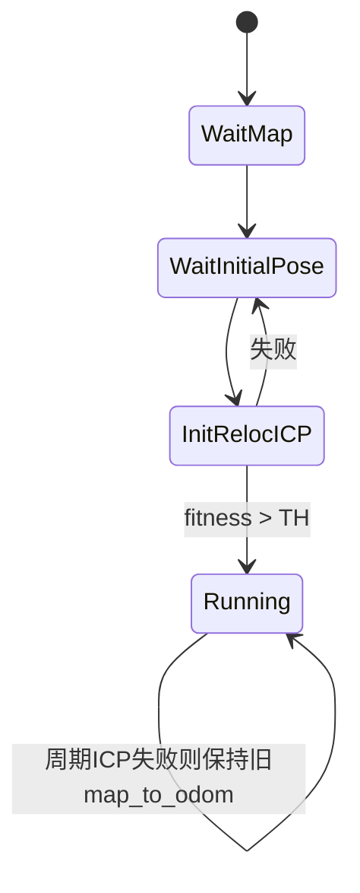

# HViktorTsoi_FAST_LIO_LOCALIZATION 代码阅读笔记（重定位/纯定位实现专项）

## 1. 结论先看（针对你的关注点）

这个项目的“重定位/纯定位”不是单节点内的显式模式开关，而是**三节点协同的隐式分层架构**：

1. `fastlio_mapping`（C++）：持续做高频局部里程计（scan-to-map，IKFoM）；
2. `global_localization.py`（Python）：低频在全局地图上做 ICP 重定位，输出 `map_to_odom`；
3. `transform_fusion.py`（Python）：融合 `map_to_odom` 与 FAST-LIO odom，输出全局定位 `/localization`。

所以它的“纯定位”实质是：  
**高频局部跟踪 + 低频全局纠偏并行运行**，而不是“先重定位后切换到另一个独立模式”。

---

## 2. 关键文件（按重要性）

1. `HViktorTsoi_FAST_LIO_LOCALIZATION/src/laserMapping.cpp`
2. `HViktorTsoi_FAST_LIO_LOCALIZATION/scripts/global_localization.py`
3. `HViktorTsoi_FAST_LIO_LOCALIZATION/scripts/transform_fusion.py`
4. `HViktorTsoi_FAST_LIO_LOCALIZATION/src/IMU_Processing.hpp`
5. `HViktorTsoi_FAST_LIO_LOCALIZATION/src/preprocess.cpp`
6. `HViktorTsoi_FAST_LIO_LOCALIZATION/include/use-ikfom.hpp`
7. `HViktorTsoi_FAST_LIO_LOCALIZATION/include/common_lib.h`
8. `HViktorTsoi_FAST_LIO_LOCALIZATION/scripts/publish_initial_pose.py`
9. `HViktorTsoi_FAST_LIO_LOCALIZATION/launch/localization_*.launch`
10. `HViktorTsoi_FAST_LIO_LOCALIZATION/config/*.yaml`

---

## 3. 系统总流程

```mermaid
flowchart TD
    A[启动 launch] --> B[fastlio_mapping 节点]
    A --> C[global_localization.py]
    A --> D[transform_fusion.py]

    B --> E[/Odometry + /cloud_registered]
    C --> F[/map_to_odom]
    E --> D
    F --> D
    D --> G[/localization + TF(map相关)]
```

---

## 4. 节点级职责与主链路

## 4.1 `fastlio_mapping`（`laserMapping.cpp`）

### 输入
- LiDAR：`livox_pcl_cbk` 或 `standard_pcl_cbk`
- IMU：`imu_cbk`

### 主循环
1. `sync_packages()` 组包 LiDAR + IMU；
2. `ImuProcess::Process()` 做预测与点云去畸变；
3. `h_share_model()` 构建点到面残差；
4. `kf.update_iterated_dyn_share_modified(...)` 迭代更新状态；
5. `publish_odometry()`/发布点云路径；
6. `map_incremental()` 增量更新 ikd-tree 地图；
7. `lasermap_fov_segment()` 维护局部地图窗口。

### 输出
- `/Odometry`
- `/cloud_registered`
- `/cloud_registered_body`
- `/path`

> 注意：该节点发布的里程计是局部连续里程计（`camera_init -> body`），不是最终全局纠偏结果。

## 4.2 `global_localization.py`

### 初始化阶段
1. 等待 `/map`（全局 PCD）；
2. 等待 `/initialpose`（手工或外部初值）；
3. 用 Open3D ICP（粗+精）做初始化匹配；
4. 仅当 `fitness > LOCALIZATION_TH`（默认 0.95）判定成功；
5. 成功后开始周期线程持续全局匹配。

### 周期阶段
- 基于当前估计位姿裁剪全局 FOV 子图（`crop_global_map_in_FOV`）；
- 再做粗精 ICP；
- 成功则更新 `T_map_to_odom` 并发布 `/map_to_odom`。

## 4.3 `transform_fusion.py`

- 订阅 `/Odometry` 与 `/map_to_odom`；
- 计算 `T_map_to_base = T_map_to_odom * T_odom_to_base`；
- 发布 `/localization`（全局位姿）；
- 同时广播 map 相关 TF。

---

## 5. “重定位/纯定位模式”实现判定

## 5.1 是否有显式模式参数？

- 未见类似 `localization_mode` 或枚举状态机。
- 关键是隐式状态量：
  - `global_localization.py`：`initialized`
  - `global_localization.py`：`T_map_to_odom`
  - `laserMapping.cpp`：`flg_EKF_inited`

## 5.2 实际状态机（按行为抽象）



这个状态机里，所谓“纯定位”是 `Running` 状态下持续输出的行为，而不是单独节点切换。

---

## 6. 地图组织与检索结构

## 6.1 全局地图
- 由外部 PCD 通过 `/map` 提供给 `global_localization.py`。

## 6.2 FOV子图
- `crop_global_map_in_FOV()` 按当前位置在全图中裁剪局部目标，提高 ICP 稳定性和速度。

## 6.3 在线局部地图（FAST-LIO内部）
- `laserMapping.cpp` 使用 `ikdtree`（ikd-tree）维护局部点地图；
- `lasermap_fov_segment()` 维护立方体窗口并删点。

## 6.4 全局候选检索能力
- 未见 ScanContext/回环词袋等全局检索；
- 全局重定位强依赖初始位姿与局部 ICP 收敛域。

---

## 7. 重定位算法细节（`global_localization.py`）

## 7.1 候选与初值
- 首次初值：`/initialpose`
- 周期初值：上一轮 `T_map_to_odom`

## 7.2 配准策略
- `registration_at_scale(..., scale=5)` 粗配准
- `registration_at_scale(..., scale=1)` 精配准

## 7.3 成功判据与失败处理
- 成功：`fitness > LOCALIZATION_TH`
- 失败：不更新 `T_map_to_odom`，等待下次周期继续尝试

---

## 8. 纯定位跟踪（`laserMapping.cpp`）

该部分是 FAST-LIO 风格紧耦合局部跟踪：

- 预测：IMU 驱动状态传播；
- 更新：LiDAR 点到面残差（`h_share_model`）；
- 优化：IKFoM 迭代误差状态卡尔曼；
- 地图：ikd-tree 增量更新。

这一链路保证高频连续性，而全局一致性由 `map_to_odom` 慢速纠偏实现。

---

## 9. IMU/LiDAR 融合、时序同步、去畸变

## 9.1 时间同步
- 参数：`common/time_sync_en`
- 在 LiDAR/IMU 回调里估计并修正 `timediff_lidar_wrt_imu`。

## 9.2 去畸变
- `ImuProcess::UndistortPcl()`：
  - 按点内时间偏移排序；
  - IMU 前向积分轨迹；
  - 逐点反向补偿到统一时刻。

## 9.3 融合
- 通过 IKFoM 系统模型与测量模型完成预测-更新闭环。

---

## 10. 输出链路

- `laserMapping.cpp`：
  - `/Odometry`
  - `/cloud_registered`
  - `/cloud_registered_body`
  - `/path`
- `global_localization.py`：
  - `/map_to_odom`
  - `/submap`
  - `/cur_scan_in_map`
- `transform_fusion.py`：
  - `/localization`
  - map 相关 TF 广播

---

## 11. 关键函数索引（>=12）

1. `main` (`src/laserMapping.cpp`)：主入口与主循环  
2. `sync_packages` (`src/laserMapping.cpp`)：组包同步  
3. `livox_pcl_cbk` (`src/laserMapping.cpp`)：Livox回调  
4. `standard_pcl_cbk` (`src/laserMapping.cpp`)：标准点云回调  
5. `imu_cbk` (`src/laserMapping.cpp`)：IMU回调  
6. `lasermap_fov_segment` (`src/laserMapping.cpp`)：局部地图窗口维护  
7. `h_share_model` (`src/laserMapping.cpp`)：点面残差/Jacobian构建  
8. `map_incremental` (`src/laserMapping.cpp`)：增量建图  
9. `publish_odometry` (`src/laserMapping.cpp`)：里程计与tf发布  
10. `ImuProcess::Process` (`src/IMU_Processing.hpp`)：IMU处理入口  
11. `ImuProcess::IMU_init` (`src/IMU_Processing.hpp`)：初始化重力/偏置  
12. `ImuProcess::UndistortPcl` (`src/IMU_Processing.hpp`)：去畸变  
13. `global_localization` (`scripts/global_localization.py`)：全局ICP主流程  
14. `crop_global_map_in_FOV` (`scripts/global_localization.py`)：裁剪子图  
15. `registration_at_scale` (`scripts/global_localization.py`)：ICP封装  
16. `transform_fusion` (`scripts/transform_fusion.py`)：全局位姿融合发布

---

## 12. 工程风险与技术债（重定位/纯定位相关）

1. **无显式模式管理**：三节点靠话题耦合，诊断复杂。  
2. **重定位失败恢复弱**：失败只跳过，不做分级恢复（扩窗、多初值等）。  
3. **全局检索能力不足**：没有 SC/回环候选召回，初值偏差大时易失败。  
4. **线程安全隐患（Python）**：多线程共享变量读写未严格锁保护。  
5. **时间戳一致性风险**：部分发布用 `ros::Time::now()`，与传感器时序可能不完全一致。  
6. **大地图开销**：Python 端反复裁剪全局图，超大地图下 CPU/内存压力明显。

---

## 13. 一句话定位该实现

这是一个“**FAST-LIO高频局部定位 + Python低频全局ICP纠偏 + 融合输出**”的工程实现；  
能工作、结构清晰，但在“全局召回与失败恢复”方面还有明显可增强空间。

