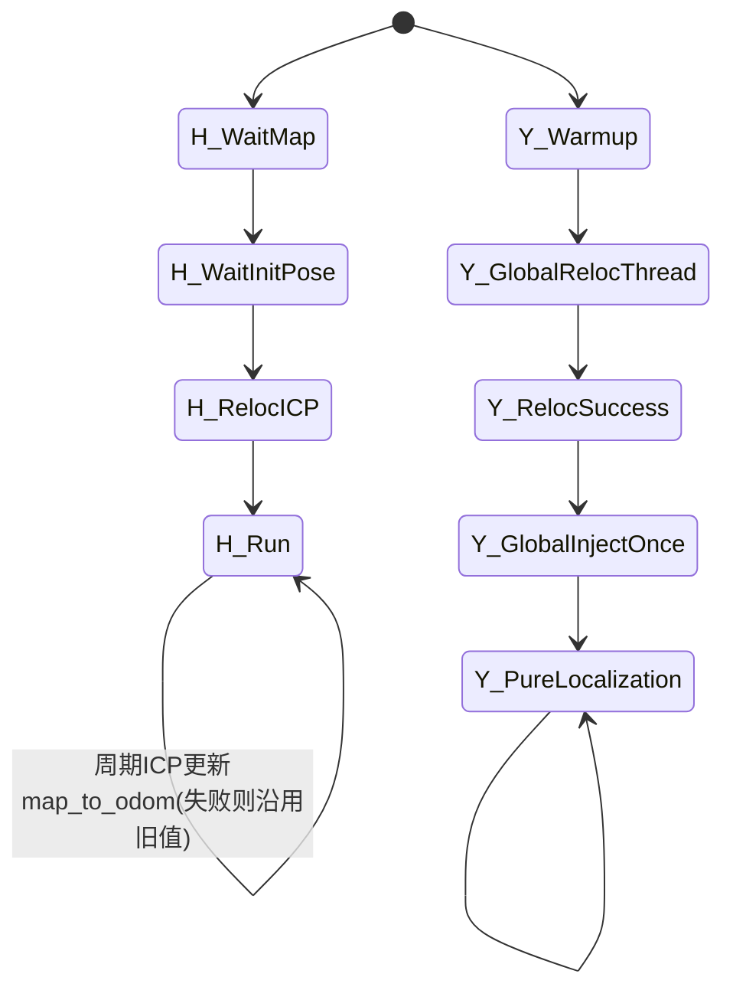

# HViktorTsoi vs YWL0720 深度对比（重定位 / 基于地图纯定位）

## 1. 对比对象

- `HViktorTsoi/FAST_LIO_LOCALIZATION`
- `YWL0720/FAST-LOCALIZATION`

---

## 2. 一句话结论

- `HViktorTsoi`：**三节点协同**（FAST-LIO 局部跟踪 + Python 全局 ICP + 融合节点），实现直观、易调试，但重定位候选检索能力弱（强依赖初值）。  
- `YWL0720`：**单主节点 + 异步全局线程**（ScanContext 候选检索 + ICP 初始化 + 切换全局树纯定位），全局召回能力更强，但参数与实现存在不一致（`localization_mode` 悬空）。

---

## 3. 架构对比（最关键差异）

```mermaid
flowchart LR
    subgraph H[HViktorTsoi]
      H1[laserMapping.cpp<br/>高频局部LIO] --> H3[transform_fusion.py]
      H2[global_localization.py<br/>低频ICP生成map_to_odom] --> H3
      H3 --> H4[/localization + TF]
    end

    subgraph Y[YWL0720]
      Y1[laserMapping.cpp主线程<br/>高频LIO] --> Y3[状态更新]
      Y2[global_localization线程<br/>SC候选+ICP] --> Y3
      Y3 --> Y4[切换ikdtree_global后纯定位]
    end
```

**核心差异**：

1. `HViktorTsoi` 是“多节点话题耦合”；`YWL0720` 是“单进程多线程耦合”。  
2. `HViktorTsoi` 全局重定位主要靠初值+ICP；`YWL0720` 有 SC 候选召回。  
3. `YWL0720` 有明显“初始化成功后切纯定位”的代码动作（`ikdtree = ikdtree_global`）；`HViktorTsoi` 更像持续纠偏架构。  

---

## 4. 重定位链路逐步对比（细节）

## 4.1 初始化触发

- `HViktorTsoi`
  - 等待 `/map` 和 `/initialpose`
  - `global_localization.py` 用 `/initialpose` 作为首次初始化输入
- `YWL0720`
  - 启动后积累初始化帧
  - 异步线程对初始化帧做 SC 检索 + ICP

## 4.2 候选检索能力

- `HViktorTsoi`：无全局描述子检索，主要依赖初值与 FOV 裁剪后 ICP。  
- `YWL0720`：`ScanContext::detectLoopClosureID()` 提供候选帧 + yaw 初值（明显更强）。  

## 4.3 配准策略

- `HViktorTsoi`
  - Open3D ICP 两阶段（粗 `scale=5` + 精 `scale=1`）
  - 成功判据：`fitness > LOCALIZATION_TH`（默认 0.95）
- `YWL0720`
  - SC 先给 yaw 初值
  - PCL ICP 粗配+精配
  - 双次结果一致性（位置差 < 2m）后才确认完成

## 4.4 重定位输出注入方式

- `HViktorTsoi`
  - 发布 `/map_to_odom`
  - `transform_fusion.py` 融合 odom 与 map_to_odom，输出 `/localization`
- `YWL0720`
  - 全局线程置位 `global_localization_finish`
  - 主线程一次性做 `global_update`，并替换主查询树为 `ikdtree_global`

---

## 5. 纯定位链路对比（基于地图）

## 5.1 共同点

两者都以 FAST-LIO 风格的 IEKF scan-to-map 为核心：

- `sync_packages`
- `ImuProcess::Process` 去畸变
- `h_share_model` 点到面残差
- `update_iterated_dyn_share_modified` 迭代更新

## 5.2 关键不同点

- `HViktorTsoi`
  - 纯定位并非“单独阶段”，而是持续局部跟踪 + 低频全局纠偏共存
  - 更强调运行中持续修正 `map_to_odom`
- `YWL0720`
  - 明确存在“重定位成功后进入全局地图纯定位跟踪”的切换动作
  - 重定位完成后不再依赖初始化缓存流程

---

## 6. 状态机对比（代码语义）



**解读**：

- `HViktorTsoi` 是“运行中持续纠偏”状态机。  
- `YWL0720` 更接近“初始化重定位 -> 稳态纯定位”状态机。  

---

## 7. 参数-行为一致性对比（很重要）

- `HViktorTsoi`
  - 参数整体与行为较一致（例如 `time_sync_en`、阈值参数）
  - 但全局候选检索能力不足是架构短板，不是参数问题

- `YWL0720`
  - `common/localization_mode` 在配置中有注释（1/2），**但实际未参与分支**
  - 真正行为由 `global_localization_finish/global_update` 控制
  - 这是“配置语义与代码语义不一致”的典型技术债

---

## 8. 失败恢复能力对比

## 8.1 重定位失败

- `HViktorTsoi`：本轮匹配失败不更新 `map_to_odom`，下轮继续重试。  
- `YWL0720`：候选失败或ICP失败则继续累计帧重试，未成功前不切换全局。  

## 8.2 跟踪失锁后自动回切重定位

- `HViktorTsoi`：没有明确 lost 检测状态机。  
- `YWL0720`：同样缺少完整 lost->relocalization 自动闭环。  

## 8.3 对比结论

- 两者都“可重试”，但都缺“显式失锁恢复闭环”。  
- 若只看“全局召回能力”，`YWL0720` 更强（SC）。  
- 若只看“运行时工程可观测性”，`HViktorTsoi` 更直观（节点解耦清晰）。  

---

## 9. 计算与工程复杂度对比

- `HViktorTsoi`
  - 优点：模块分离，单模块逻辑相对简单
  - 代价：多节点时序与TF一致性调试复杂度高

- `YWL0720`
  - 优点：数据在单主节点内流动，状态切换直接
  - 代价：主文件职责较重（线程+地图+定位），维护门槛更高

---

## 10. 优缺点总表（聚焦重定位/纯定位）

### `HViktorTsoi/FAST_LIO_LOCALIZATION`

- **优点**
  - 三节点分工明确（定位、重定位、融合）
  - 周期性全局纠偏自然，运行中连续修正
  - 易于替换重定位模块（保留 `/map_to_odom` 接口）
- **缺点**
  - 无全局候选召回（依赖初值）
  - 线程安全与时间同步细节在 Python 层较脆弱
  - 无显式失锁状态机

### `YWL0720/FAST-LOCALIZATION`

- **优点**
  - SC + ICP 的“检索+配准”组合更适合大范围初始化
  - 有明确从初始化到纯定位的切换动作
  - 使用全局 `ikdtree` 后纯定位路径清晰
- **缺点**
  - `localization_mode` 参数未接入实际逻辑
  - 失锁后自动重定位闭环不足
  - 单文件职责偏重，后续扩展需谨慎重构

---

## 11. 选型建议（只在这两者里选）

- 如果你更在意**初始化召回能力与工程鲁棒性上限**：优先 `YWL0720`（但建议先修 `localization_mode` 与失锁恢复）。  
- 如果你更在意**系统可拆分、可替换和快速联调**：优先 `HViktorTsoi`（但建议补全局召回能力）。  

---

## 12. 建议你下一步优先改造点

1. 给两者都补统一状态机：`Tracking / Relocalizing / Lost / Recovery`。  
2. `HViktorTsoi`：加入 SC 或其他全局候选召回，降低初值依赖。  
3. `YWL0720`：让 `localization_mode` 真正控制策略分支，并补运行中失锁检测。  
4. 增加统一质量指标：有效点比例、残差分布、位姿跳变、匹配置信度。  

