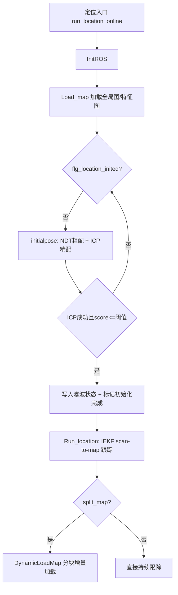

# Liansheng-Wang_faster_lio_localization 代码阅读笔记（重定位/纯定位实现专项）

## 1. 核心结论（先看这个）

这个仓库相比前两个，**明确提供了“定位模式”开关**（`location_mode`），并把建图与定位分成两条入口：

- 建图入口：`run_mapping_online.cc`
- 定位入口：`run_location_online.cc`

在定位模式下，流程是：

1. 先加载离线地图（全局图+特征图）；
2. 用初始位姿（RViz `/initialpose` 或 yaml）做 `NDT + ICP` 初始化；
3. 初始化成功后进入“纯定位跟踪”（IEKF scan-to-map）；
4. 可选分块地图动态加载（`split_map`）。

---

## 2. 关键文件（按重要性）

1. `Liansheng-Wang_faster_lio_localization/src/LIO-Lite/src/laser_mapping.cc`
2. `Liansheng-Wang_faster_lio_localization/src/LIO-Lite/include/laser_mapping.h`
3. `Liansheng-Wang_faster_lio_localization/src/LIO-Lite/src/run_location_online.cc`
4. `Liansheng-Wang_faster_lio_localization/src/LIO-Lite/src/run_mapping_online.cc`
5. `Liansheng-Wang_faster_lio_localization/src/LIO-Lite/include/imu_processing.hpp`
6. `Liansheng-Wang_faster_lio_localization/src/LIO-Lite/src/pointcloud_preprocess.cc`
7. `Liansheng-Wang_faster_lio_localization/src/LIO-Lite/include/use-ikfom.hpp`
8. `Liansheng-Wang_faster_lio_localization/src/LIO-Lite/config/mid360.yaml`
9. `Liansheng-Wang_faster_lio_localization/src/LIO-Lite/launch/location_360.launch`
10. `Liansheng-Wang_faster_lio_localization/src/LIO-Lite/include/ivox3d/*`

---

## 3. 入口、初始化与主链路

## 3.1 入口二分

- 建图：`run_mapping_online.cc` -> `LaserMapping::Run()`
- 定位：`run_location_online.cc` -> `LaserMapping::Load_map()` -> `LaserMapping::Run_location()`

这点非常关键：它不是在同一个 `main` 里动态切模式，而是入口文件就分开了。

## 3.2 初始化与参数

`LaserMapping::InitROS()` 做：

1. `LoadParams()` 读取参数；
2. `SubAndPubToROS()` 建立订阅发布；
3. 初始化 IVox 地图结构；
4. 根据 `flg_islocation_mode_` 选择观测模型：
   - 建图：`ObsModel`
   - 定位：`ObsModel_location`

参数中和模式最相关的有：

- `location_mode`
- `load_g_map`
- `load_f_map`
- `split_map`
- `init_trans`
- `init_rpy`

## 3.3 主流程图

---

## 4. 是否有“重定位/纯定位模式”显式区分

## 4.1 明确有

- 参数：`location_mode`
- 状态：
  - `flg_islocation_mode_`
  - `flg_location_inited_`
  - `flg_get_init_guess_`

## 4.2 分支位置

1. `LoadParams()` 读取 `location_mode`
2. `SubAndPubToROS()` 在定位模式下额外订阅 `/initialpose`、发布地图
3. `InitROS()` 选择 `ObsModel_location`
4. 主循环使用 `Run_location()`（定位路径）

---

## 5. 地图来源与组织

## 5.1 地图来源

- 从 `ROOTDIR/maps/<load_g_map>` 与 `ROOTDIR/maps/<load_f_map>` 读取 PCD。

## 5.2 地图结构

- `global_map_`：全局地图（初始化对齐目标/可视化）
- `pcl_feature_point_`：特征地图点
- `ivox_`：在线最近邻检索结构（核心）

## 5.3 局部化策略

- `split_map=false`：一次性加载特征地图到 `ivox_`
- `split_map=true`：只加载索引，运行时 `DynamicLoadMap()` 依据位姿增量加载邻域子图

> 这里使用的是 IVox，不是 ikd-tree / ScanContext。

---

## 6. 全局初始化/重定位算法

## 6.1 初值来源

1. 优先 RViz `/initialpose`（`initialpose_callback`）
2. 否则使用 yaml 的 `init_trans` + `init_rpy`

## 6.2 算法

`initialpose()` 流程：

1. 当前帧点云与地图做 NDT 粗配准；
2. 用 NDT 输出作为 ICP 初值；
3. ICP 精配准得到最终位姿。

## 6.3 成功判据

- `icp.hasConverged() == true`
- `icp.getFitnessScore() <= 0.25`

成功后：

- 更新滤波器状态 `kf_.change_x(init_state)`
- `flg_location_inited_ = true`
- 取消 `/initialpose` 订阅
- 分块模式立即触发一次 `DynamicLoadMap`

---

## 7. 纯定位跟踪流程（初始化后）

`Run_location()` 每帧：

1. `SyncPackages()` 对齐 LiDAR + IMU；
2. `ImuProcess::Process()` 做预测与去畸变；
3. 点云降采样；
4. `kf_.update_iterated_dyn_share_modified(...)`（观测模型为 `ObsModel_location`）；
5. 分块模式调用 `DynamicLoadMap(state_point_.pos)`；
6. 发布 odom/path/tf/cloud。

残差模型是典型点到平面：

- `ivox_->GetClosestPoint` 取邻域
- `esti_plane` 拟合平面
- 用平面距离构建 IEKF 的 `H` 与 `h`

---

## 8. IMU/LiDAR融合、时间同步、去畸变

## 8.1 融合框架

- IKFoM IEKF（状态包含 `pos/rot/vel/bg/ba/grav` + 外参）。

## 8.2 时间同步

- `time_sync_en` 控制时间偏差估计；
- IMU回调中可根据估计偏差修正时间戳；
- `SyncPackages()` 按雷达帧结束时间切分 IMU。

## 8.3 去畸变

- `ImuProcess::UndistortPcl()`：
  - 点按时间排序；
  - IMU前向传播；
  - 点反向补偿到帧末。

---

## 9. 输出链路

- `/Odometry` + `map->body` TF
- `/path`
- `/cloud_registered`
- `/cloud_registered_body`
- `/cloud_registered_effect_world`
- 定位模式可视化：
  - `/global_map`
  - `/feature_map`
- UAV接口：
  - `/mavros/vision_pose/pose`

---

## 10. 关键函数索引（>=12）

1. `main` (`src/run_location_online.cc`)：定位入口  
2. `main` (`src/run_mapping_online.cc`)：建图入口  
3. `LaserMapping::InitROS`：总初始化  
4. `LaserMapping::LoadParams`：参数读取（含 `location_mode`）  
5. `LaserMapping::SubAndPubToROS`：订阅发布注册  
6. `LaserMapping::Run_location`：定位主循环  
7. `LaserMapping::Load_map`：离线地图加载  
8. `LaserMapping::initialpose`：NDT+ICP 初始化重定位  
9. `LaserMapping::initialpose_callback`：接收 RViz 初始位姿  
10. `LaserMapping::DynamicLoadMap`：分块地图增量加载  
11. `LaserMapping::ObsModel_location`：定位观测模型  
12. `LaserMapping::SyncPackages`：组包同步  
13. `ImuProcess::Process`：IMU流程入口  
14. `ImuProcess::UndistortPcl`：去畸变实现

---

## 11. 风险与技术债（重定位/纯定位相关）

1. **缺少全局候选检索**  
   强依赖初始位姿，远距离重定位能力有限。

2. **初始化失败恢复弱**  
   失败仅“下一帧再试”，没有分级恢复策略。

3. **分块地图卸载不完整风险**  
   从缓存结构移除远块，但检索容器中删除策略不彻底可能积累脏数据。

4. **参数鲁棒性不足**  
   `init_trans/init_rpy` 长度未充分防御。

5. **参数名不一致风险**  
   launch 里 `point_filter_num_` 与代码 `point_filter_num` 可能导致配置失效。

6. **定位失效无自动回切重定位**  
   没有“连续退化 -> 触发重新初始化”的闭环状态机。

---

## 12. 一句话评价

这是一个“**显式定位模式开关 + NDT/ICP初始化 + IEKF纯定位跟踪 + 可选分块地图加载**”的实现；  
工程上比“纯隐式模式”更清晰，但全局召回和失败恢复机制仍是主要短板。

