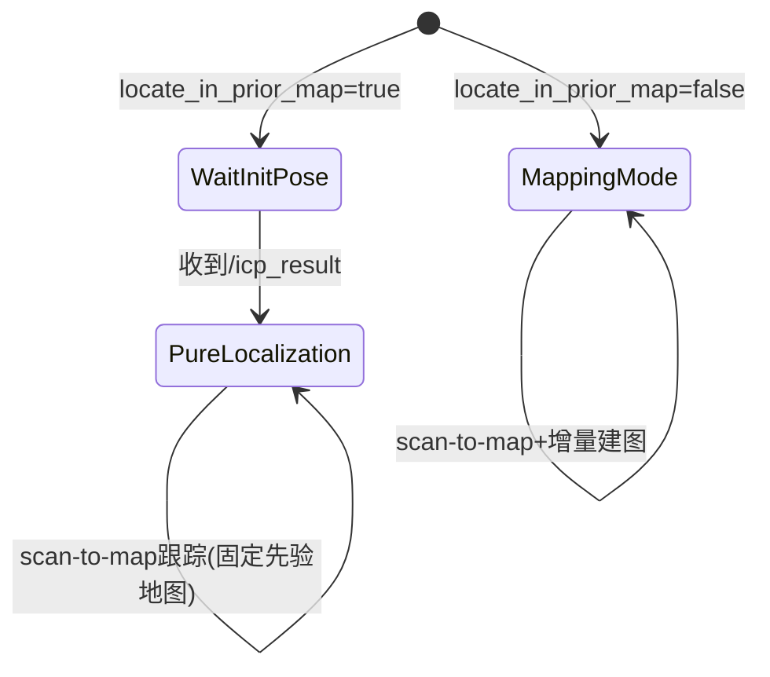

# PolarisXQ_Fast-LIO2-Localization 代码阅读笔记（重定位/纯定位实现专项）

## 1. 结论先看

这个仓库是目前你看的几个里“模式区分最直接”的一种：  
通过参数 `locate_in_prior_map` 显式切换“先验地图定位模式”与“在线建图模式”。

- `locate_in_prior_map=false`：标准 FAST-LIO2 建图（增量地图）。
- `locate_in_prior_map=true`：纯定位（固定先验地图，不增量建图），并依赖外部重定位节点先提供 `/icp_result` 作为初始位姿。

---

## 2. 关键文件（按重要性）

1. `PolarisXQ_Fast-LIO2-Localization/FAST_LIO/src/laserMapping.cpp`
2. `PolarisXQ_Fast-LIO2-Localization/FAST_LIO/src/IMU_Processing.hpp`
3. `PolarisXQ_Fast-LIO2-Localization/FAST_LIO/include/use-ikfom.hpp`
4. `PolarisXQ_Fast-LIO2-Localization/FAST_LIO/src/preprocess.cpp`
5. `PolarisXQ_Fast-LIO2-Localization/icp_relocalization/src/icp_node.cpp`
6. `PolarisXQ_Fast-LIO2-Localization/icp_relocalization/src/transform_publisher.cpp`
7. `PolarisXQ_Fast-LIO2-Localization/icp_relocalization/src/sac_ia_gicp.cpp`
8. `PolarisXQ_Fast-LIO2-Localization/FAST_LIO/config/fast_lio_relocalization_param.yaml`
9. `PolarisXQ_Fast-LIO2-Localization/FAST_LIO/launch/relocalization.launch.py`
10. `PolarisXQ_Fast-LIO2-Localization/example.launch.py`

---

## 3. 系统整体架构

```mermaid
flowchart TD
    A[ICP重定位节点 icp_node] --> B[/icp_result]
    B --> C[FAST_LIO laserMapping]
    C --> D[/Odometry /path /cloud_registered]
    B --> E[transform_publisher]
    E --> F[TF map->odom]
    C --> G[TF odom->sensor/base]
```

说明：

- `icp_node` 负责初始化重定位；
- `laserMapping` 负责持续跟踪；
- `transform_publisher` 负责把重定位结果转成 `map->odom`。

---

## 4. 入口、初始化、参数、回调/主循环

## 4.1 主入口

- `FAST_LIO/src/laserMapping.cpp`：`main()` + `rclcpp::spin(...)`
- 重定位入口：
  - `icp_relocalization/src/icp_node.cpp`
  - 可选 `icp_relocalization/src/sac_ia_gicp.cpp`

## 4.2 模式关键参数

来自 `fast_lio_relocalization_param.yaml`：

- `locate_in_prior_map`
- `prior_map_path`
- `common.time_sync_en`
- `common.time_offset_lidar_to_imu`

## 4.3 主节点关键分支（`laserMapping.cpp`）

1. 若 `locate_in_prior_map=true`：
   - 订阅 `/icp_result`；
   - 未收到初始位姿时，LiDAR/IMU回调和 `timer_callback` 直接返回；
   - 地图初始化用先验 PCD；
   - **不调用 `map_incremental()`**。
2. 若 `locate_in_prior_map=false`：
   - 正常建图流程；
   - 持续 `map_incremental()`。

---

## 5. 重定位 / 纯定位模式实现细节

## 5.1 显式模式划分（有）



## 5.2 重定位节点（`icp_node.cpp`）

- 输入：
  - 实时点云（Livox 或 PointCloud2）
  - `initialpose`（可选）
- 算法：
  - PCL ICP
- 成功判据：
  - `hasConverged`
  - `fitness_score < fitness_score_thre`
  - 连续成功次数达到 `converged_count_thre`
- 成功后：
  - 发布 `icp_result`
  - 节点 `shutdown` 退出（一次性重定位）

## 5.3 纯定位阶段（`laserMapping.cpp`）

- 用先验地图建 `ikdtree`；
- 运行 FAST-LIO scan-to-map IEKF 更新；
- 禁止在线增量建图；
- 持续发布 odom/path/cloud/tf。

---

## 6. 地图组织与索引结构

- 先验地图：
  - 通过 `prior_map_path` 加载 PCD
  - 下采样后用于定位
- 在线地图结构：
  - `ikdtree`（`KD_TREE<PointType>`）
- 局部地图维护：
  - `lasermap_fov_segment()`（建图场景更有意义）
- 关键帧/回环：
  - 未见显式 keyframe 管理或回环图优化模块。

---

## 7. 纯定位跟踪（scan-to-map）

主流程在 `timer_callback()`：

1. `sync_packages()` 对齐 LiDAR + IMU；
2. `p_imu->Process()` 去畸变与预测；
3. 点云下采样；
4. `h_share_model()` 构建点面残差；
5. `kf.update_iterated_dyn_share_modified(...)`；
6. 发布 odom/path/cloud。

观测模型核心：

- `ikdtree.Nearest_Search`
- `esti_plane` 平面拟合
- 残差 `pd2`（点到面距离）

---

## 8. IMU/LiDAR融合、同步、去畸变

- 融合框架：IKFoM 误差状态迭代 EKF；
- 同步：
  - 固定偏移 `time_offset_lidar_to_imu`
  - 可选自同步 `time_sync_en`
- 去畸变：
  - `UndistortPcl()` 中 IMU 前向积分 + 点级反向补偿。

---

## 9. 输出链路

- FAST-LIO：
  - `/Odometry`
  - `/path`
  - `/cloud_registered`
  - `/cloud_registered_body`
  - `/cloud_effected`
  - `/Laser_map`
  - TF（`odom->sensor/base`）
- 重定位链：
  - `icp_node` 发布 `icp_result`
  - `transform_publisher` 发布 `map->odom` TF

---

## 10. 关键函数索引（>=12）

1. `LaserMappingNode::timer_callback` (`FAST_LIO/src/laserMapping.cpp`)  
2. `LaserMappingNode::sync_packages` (`FAST_LIO/src/laserMapping.cpp`)  
3. `LaserMappingNode::initial_pose_cbk` (`FAST_LIO/src/laserMapping.cpp`)  
4. `LaserMappingNode::lasermap_fov_segment` (`FAST_LIO/src/laserMapping.cpp`)  
5. `LaserMappingNode::map_incremental` (`FAST_LIO/src/laserMapping.cpp`)  
6. `h_share_model` (`FAST_LIO/src/laserMapping.cpp`)  
7. `ImuProcess::Process` (`FAST_LIO/src/IMU_Processing.hpp`)  
8. `ImuProcess::IMU_init` (`FAST_LIO/src/IMU_Processing.hpp`)  
9. `ImuProcess::UndistortPcl` (`FAST_LIO/src/IMU_Processing.hpp`)  
10. `ICPNode::cloud_callback` (`icp_relocalization/src/icp_node.cpp`)  
11. `ICPNode::lvx_cloud_callback` (`icp_relocalization/src/icp_node.cpp`)  
12. `ICPNode::pose_callback` (`icp_relocalization/src/icp_node.cpp`)  
13. `TransformPublisherNode::callback` (`icp_relocalization/src/transform_publisher.cpp`)  
14. `SACIAGICPNode::sourceCloudCallback` (`icp_relocalization/src/sac_ia_gicp.cpp`)  
15. `SACIAGICPNode::computeFPFHFeature` (`icp_relocalization/src/sac_ia_gicp.cpp`)

---

## 11. 风险与技术债（重定位失败恢复重点）

1. **缺少主链路内建自动重定位恢复**  
   跟踪退化后不会自动触发重定位。

2. **`icp_node` 一次成功即退出**  
   后续再次丢失定位需要外部手动重启重定位节点。

3. **`map->odom` 用静态广播器发布动态估计结果**  
   语义上存在不一致风险。

4. **等待初始位姿期间直接丢帧**  
   初始化延迟时，数据连续性受影响。

5. **重定位成功判据偏单一**  
   主要靠 fitness + 连续次数，缺少多指标一致性约束。

6. **全局候选检索弱**  
   默认 ICP 流程对初值依赖较强；虽有 SAC-IA 版本，但与主定位链路耦合不紧。

---

## 12. 一句话评价

这是一个“**显式模式开关 + 外部ICP初始化 + FAST-LIO纯定位跟踪**”的工程实现；  
结构清晰、易理解，但“丢失后自动恢复闭环”仍需补齐。

