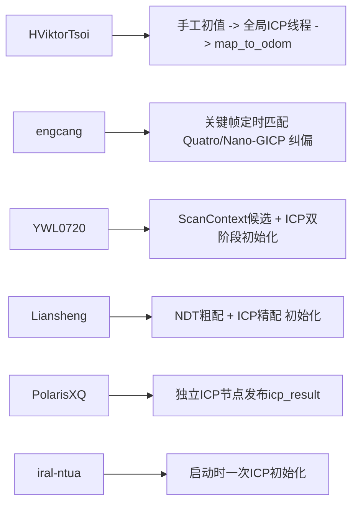
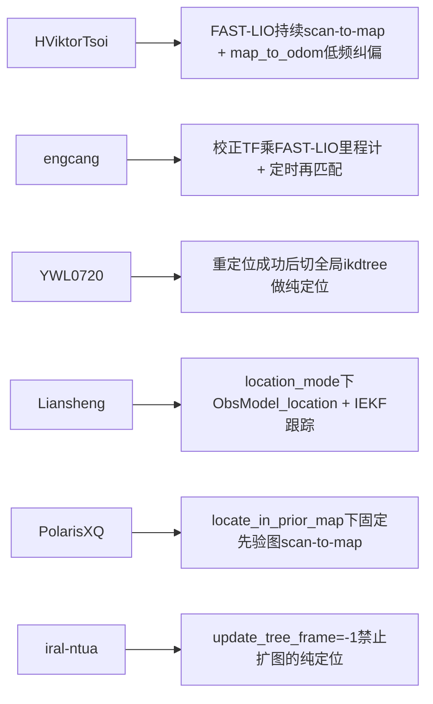

# 基于 FAST-LIO / FAST-LIO2 的重定位与纯定位仓库横向对比

## 仓库清单

1. `HViktorTsoi/FAST_LIO_LOCALIZATION` — ⭐ 965  
https://github.com/HViktorTsoi/FAST_LIO_LOCALIZATION

2. `engcang/FAST-LIO-Localization-QN` — ⭐ 276  
https://github.com/engcang/FAST-LIO-Localization-QN

3. `YWL0720/FAST-LOCALIZATION` — ⭐ 246  
https://github.com/YWL0720/FAST-LOCALIZATION

4. `Liansheng-Wang/faster_lio_localization` — ⭐ 192  
https://github.com/Liansheng-Wang/faster_lio_localization

5. `PolarisXQ/Fast-LIO2-Localization` — ⭐ 64  
https://github.com/PolarisXQ/Fast-LIO2-Localization

6. `iral-ntua/FAST_LIO_LOCALIZATION` — ⭐ 23  
https://github.com/iral-ntua/FAST_LIO_LOCALIZATION

---

## 先给结论（重定位/纯定位视角）

- `HViktorTsoi`：三节点协同（FAST-LIO 局部里程计 + Python 全局 ICP + TF 融合），工程直观，适合快速落地。
- `engcang`：本仓库更像“持续定位 + 定时全局纠偏”，没有显式重定位/纯定位状态机，偏工程增强版后端纠偏。
- `YWL0720`：有全局初始化线程（ScanContext + ICP）再切纯定位跟踪的思路，但 `localization_mode` 参数当前未真正接入分支。
- `Liansheng-Wang`：`location_mode` 显式生效，定位入口和建图入口分离，初始化 `NDT+ICP`，纯定位路径清晰。
- `PolarisXQ`：`locate_in_prior_map` 显式切换，外部 ICP 成功后进入 FAST-LIO2 纯定位，结构清楚但恢复链路依赖外部节点。
- `iral-ntua`：启动阶段一次性 ICP 初始化，运行时通过 `update_tree_frame=-1` 进入纯定位，简洁但失败恢复最弱（初始化失败直接退出）。

---

## 六仓库实现范式对比（重定位怎么做）

---

## 六仓库实现范式对比（纯定位怎么做）

---

## 单仓库横向点评（重点差异、优缺点）

### 1) `HViktorTsoi/FAST_LIO_LOCALIZATION`

- **重定位机制**：`global_localization.py` 使用 FOV 子图 + 双层 ICP（粗/精）估计 `map_to_odom`。  
- **纯定位机制**：`laserMapping.cpp` 高频局部跟踪，`transform_fusion.py` 融合全局纠偏输出。  
- **优点**：模块职责清楚，调试路径直观，容易插入外部初值。  
- **缺点**：无显式统一状态机；失败恢复主要靠重试，没有全局候选检索（如 SC）。  

### 2) `engcang/FAST-LIO-Localization-QN`

- **重定位机制**：基于关键帧定时匹配（Quatro + Nano-GICP 或 Nano-GICP），成功后更新 `last_corrected_TF_`。  
- **纯定位机制**：实时输出 `pose_corrected = last_corrected_TF_ * FAST_LIO_odom`。  
- **优点**：实现整洁，配准模块化，工程可维护性较好。  
- **缺点**：没有显式“重定位/纯定位”状态机；无全局召回检索，初值偏差大时易卡住。  

### 3) `YWL0720/FAST-LOCALIZATION`

- **重定位机制**：异步全局线程，`ScanContext` 检索候选 + ICP 粗精配准，双次一致性判定后成功。  
- **纯定位机制**：成功后切换到全局 `ikdtree`，主线程持续 scan-to-map IEKF。  
- **优点**：全局初始化链路完整，具备“候选检索 + 配准”结构。  
- **缺点**：`localization_mode` 参数读了但未实际参与逻辑；运行期失锁后自动回切重定位机制不足。  

### 4) `Liansheng-Wang/faster_lio_localization`

- **重定位机制**：`location_mode=true` 下，先 `NDT` 粗配再 `ICP` 精配完成初始化。  
- **纯定位机制**：`Run_location()` + `ObsModel_location()` 做持续 IEKF 跟踪，可选分块地图动态加载。  
- **优点**：模式分支最清楚，入口分离（mapping vs location）清晰，工程落地性强。  
- **缺点**：仍依赖给定初值；全局候选检索不足；失败恢复策略较弱。  

### 5) `PolarisXQ/Fast-LIO2-Localization`

- **重定位机制**：独立 `icp_node` 发布 `/icp_result`，主定位节点收到后解锁运行。  
- **纯定位机制**：`locate_in_prior_map=true` 时用固定先验图做 FAST-LIO2 纯定位，不增量建图。  
- **优点**：参数化模式开关明确，系统边界清楚（重定位节点 vs 跟踪节点）。  
- **缺点**：重定位节点成功后退出，二次失锁恢复依赖人工/外部编排；`map->odom` 发布语义需谨慎。  

### 6) `iral-ntua/FAST_LIO_LOCALIZATION`

- **重定位机制**：启动阶段一次 ICP 初始化（基于 `approximate_init_pose`）。  
- **纯定位机制**：`update_tree_frame=-1` 禁止地图更新，仅做定位。  
- **优点**：实现简单直接，上手成本低。  
- **缺点**：初始化失败直接退出；运行中无再重定位闭环；对初值依赖强。  

---

## 关键差异（你最关心的“重定位/纯定位”）

- **是否显式模式开关**
  - 明确有：`Liansheng-Wang`、`PolarisXQ`、`iral-ntua`（通过参数控制）
  - 隐式/弱显式：`HViktorTsoi`、`engcang`、`YWL0720`

- **是否有全局候选检索**
  - 有：`YWL0720`（ScanContext）
  - 无/弱：其余大多依赖初值 + ICP/NDT

- **纯定位阶段地图策略**
  - 固定先验图不更新：`PolarisXQ`、`iral-ntua(-1)`、`YWL0720(重定位后)`
  - 可继续局部扩图/纠偏：`HViktorTsoi`、`engcang`、`Liansheng-Wang(配置可控)`

- **失败恢复能力**
  - 相对较好（可周期重试/线程化）：`HViktorTsoi`、`YWL0720`、`engcang`
  - 中等（可重试但缺闭环）：`Liansheng-Wang`、`PolarisXQ`
  - 偏弱（失败直接停机）：`iral-ntua`

---

## 选型建议（按场景）

- **想快速复现并看清全局-局部融合逻辑**：优先 `HViktorTsoi`。  
- **想做“关键帧匹配纠偏”工程路线**：优先 `engcang`。  
- **想要“候选检索 + 初始化重定位”结构**：优先 `YWL0720`。  
- **想要模式边界清晰、方便二次开发**：优先 `Liansheng-Wang` 或 `PolarisXQ`。  
- **想要最简实现做教学/原型**：可看 `iral-ntua`，但要自行补失败恢复。  

---

## 共性改进方向（六仓库普遍适用）

1. 增加显式状态机：`Tracking / Relocalizing / Lost / Recovery`。  
2. 引入全局候选召回（ScanContext/Place Recognition）+ 局部ICP两阶段。  
3. 增加失败恢复闭环：连续失败计数、扩搜索、多初值重试、自动触发重定位。  
4. 增强质量门控：fitness 之外加入重叠率、位姿跳变、时序一致性。  
5. 统一 `map->odom` 与 `odom->base` 的发布语义与时间戳策略。  
