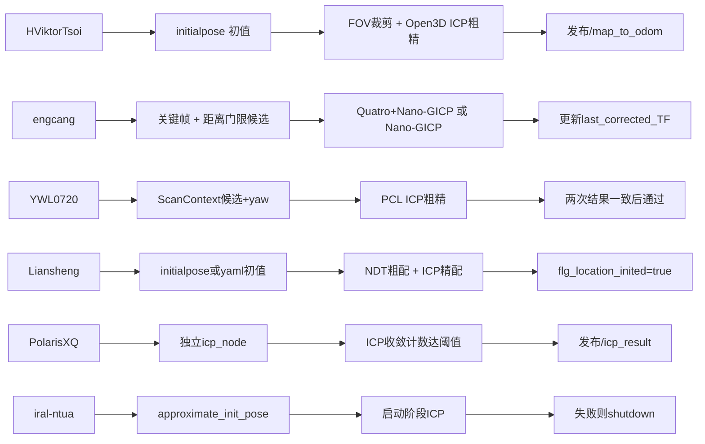
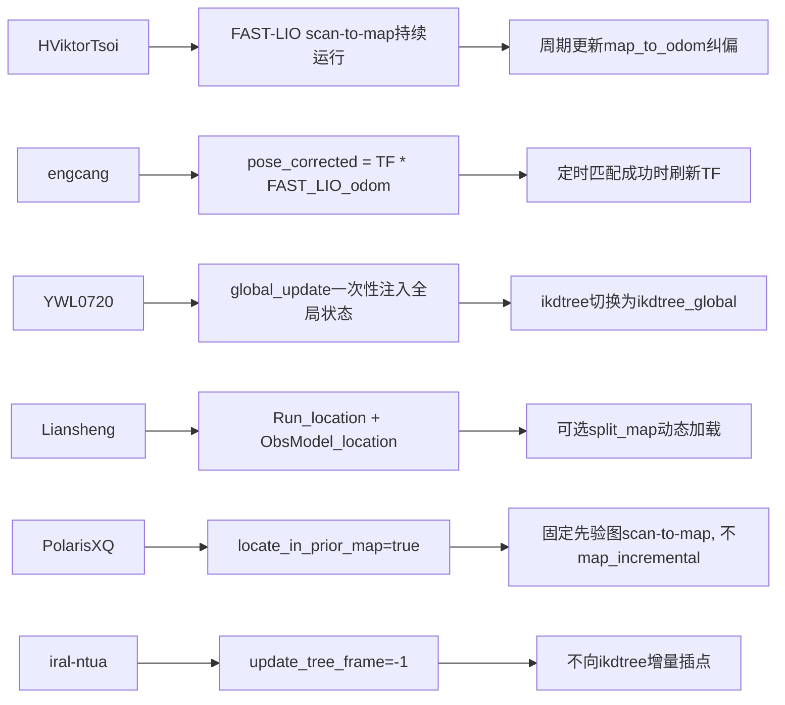
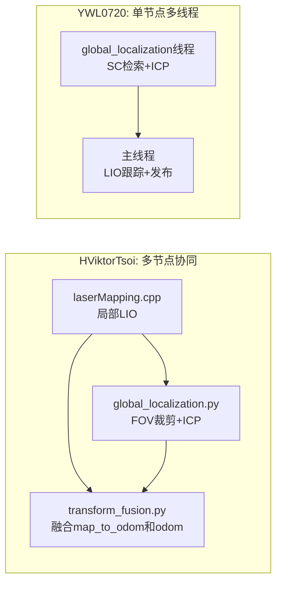

# 基于 FAST-LIO / FAST-LIO2 的重定位与纯定位仓库横向对比

## 仓库清单

1. `HViktorTsoi/FAST_LIO_LOCALIZATION` — ⭐ 965  
https://github.com/HViktorTsoi/FAST_LIO_LOCALIZATION

2. `engcang/FAST-LIO-Localization-QN` — ⭐ 276  
https://github.com/engcang/FAST-LIO-Localization-QN

3. `YWL0720/FAST-LOCALIZATION` — ⭐ 246  
https://github.com/YWL0720/FAST-LOCALIZATION

4. `Liansheng-Wang/faster_lio_localization` — ⭐ 192  
https://github.com/Liansheng-Wang/faster_lio_localization

5. `PolarisXQ/Fast-LIO2-Localization` — ⭐ 64  
https://github.com/PolarisXQ/Fast-LIO2-Localization

6. `iral-ntua/FAST_LIO_LOCALIZATION` — ⭐ 23  
https://github.com/iral-ntua/FAST_LIO_LOCALIZATION

---

## 六仓库对比（源码核对版）

## 先给结论（重定位 + 基于地图纯定位）

- `HViktorTsoi`：多节点协同（局部 LIO + 全局 ICP + 融合），重定位依赖初值，运行期周期纠偏。  
- `engcang`：统一定位流程里做定时关键帧匹配纠偏，无显式“重定位模式/纯定位模式”状态机。  
- `YWL0720`：异步全局线程（SC 检索 + ICP）成功后切换全局树纯定位，但 `localization_mode` 参数未真正接入逻辑。  
- `Liansheng-Wang`：`location_mode` 明确生效，定位入口独立，`NDT+ICP` 初始化后进入 `ObsModel_location` 跟踪。  
- `PolarisXQ`：`locate_in_prior_map` 明确切换，依赖外部 `icp_node` 先给 `/icp_result`，然后固定先验图纯定位。  
- `iral-ntua`：启动阶段一次 ICP 初始化，`update_tree_frame=-1` 即纯定位；初始化失败直接退出，恢复能力弱。  

---

## 重定位实现路径对比

---

## 基于地图纯定位实现路径对比

---

## 单仓库源码结论（重定位/纯定位）

### `HViktorTsoi/FAST_LIO_LOCALIZATION`
- **重定位**：`global_localization.py` 中 `wait_for_message('/map')` + `wait_for_message('/initialpose')`，FOV 裁剪后双阶段 ICP，`fitness > LOCALIZATION_TH` 才更新 `/map_to_odom`。  
- **纯定位**：`laserMapping.cpp` 持续局部跟踪，`transform_fusion.py` 以 `T_map_to_odom * T_odom_to_base` 输出全局位姿。  
- **优点**：模块解耦，工程联调直观。  
- **短板**：无全局候选召回；脚本层线程安全与时序一致性需加强。  

### `engcang/FAST-LIO-Localization-QN`
- **重定位**：在 `matchingTimerFunc` 周期触发 `performMapMatcher`，成功后更新 `last_corrected_TF_`。  
- **纯定位**：实时链路直接应用 `last_corrected_TF_` 修正 FAST-LIO odom。  
- **优点**：匹配模块化（Quatro/Nano-GICP）清晰。  
- **短板**：无显式状态机；候选检索主要靠半径邻近，远场重定位能力有限。  

### `YWL0720/FAST-LOCALIZATION`
- **重定位**：`global_localization()` 线程用 ScanContext 检索候选并 ICP 粗精配准，双次位置一致（<2m）才置 `global_localization_finish=true`。  
- **纯定位**：主线程检测到 `global_localization_finish && !global_update` 后，注入全局状态并 `ikdtree = std::move(ikdtree_global)`。  
- **优点**：具备全局候选召回 + 明确切换动作。  
- **短板**：`common/localization_mode` 读取但未参与分支；失锁后自动回切机制不足。  

### `Liansheng-Wang/faster_lio_localization`
- **重定位**：`location_mode=true` 时，`initialpose()` 执行 NDT 粗配 + ICP 精配，成功后写入 `kf_.change_x()`。  
- **纯定位**：`Run_location()` 走 `ObsModel_location()` 的 IEKF 跟踪，可启用 `split_map` 做动态分块加载。  
- **优点**：模式边界清晰、入口分离（mapping/location）。  
- **短板**：仍依赖可用初值；缺少全局检索召回与完整恢复闭环。  

### `PolarisXQ/Fast-LIO2-Localization`
- **重定位**：`icp_node` 连续收敛计数达到阈值后发布 `/icp_result`，主定位节点 `initial_pose_received=true` 后解锁运行。  
- **纯定位**：`locate_in_prior_map=true` 时使用先验图建树，主循环不执行 `map_incremental()`。  
- **优点**：模式开关明确，重定位与跟踪解耦。  
- **短板**：`icp_node` 成功后退出，二次失锁恢复依赖外部重启；主链路无内建自动回切。  

### `iral-ntua/FAST_LIO_LOCALIZATION`
- **重定位**：启动阶段在 `IMU_Processing.hpp` 内执行 ICP 初始化（基于 `approximate_init_pose`），失败直接 `ros::shutdown()`。  
- **纯定位**：`update_tree_frame=-1` 时 `map_incremental()` 不插点，等价固定地图纯定位。  
- **优点**：实现简单，路径短。  
- **短板**：初始化失败无重试；运行中无再重定位机制。  

---

## 横向关键差异（源码行为）

- **显式模式开关**
  - 明确有：`Liansheng-Wang`（`location_mode`）、`PolarisXQ`（`locate_in_prior_map`）、`iral-ntua`（`update_tree_frame=-1`）。
  - 弱/隐式：`HViktorTsoi`、`engcang`、`YWL0720`（其中 `YWL0720` 的 `localization_mode` 当前未生效）。

- **全局候选召回能力**
  - 明确有：`YWL0720`（ScanContext）。
  - 其余多为“初值驱动 + ICP/NDT”。

- **纯定位时地图是否更新**
  - 明确不更新：`PolarisXQ`（先验图定位）、`iral-ntua(-1)`、`YWL0720`（切全局树后稳定定位）。
  - 可继续纠偏/可配置更新：`HViktorTsoi`、`engcang`、`Liansheng-Wang`。

- **失败恢复能力**
  - 周期重试但无完整失锁闭环：`HViktorTsoi`、`engcang`、`YWL0720`、`Liansheng-Wang`、`PolarisXQ`。
  - 最弱：`iral-ntua`（初始化失败直接停机）。

---

## 选型建议（按需求）

- **要全局召回能力（大初值误差更稳）**：优先 `YWL0720`。  
- **要工程解耦、快速联调**：优先 `HViktorTsoi` 或 `PolarisXQ`。  
- **要模式边界清晰、方便二次开发**：优先 `Liansheng-Wang`。  
- **要最简链路验证想法**：可先用 `iral-ntua`，但必须补恢复机制。  

---

## 六仓共同改造方向

1. 补显式状态机：`Tracking / Relocalizing / Lost / Recovery`。  
2. 引入“全局召回 + 局部配准”两阶段统一框架。  
3. 增加失锁后自动重定位闭环（连续失败计数、扩窗、多初值重试）。  
4. 统一质量门控（fitness + 重叠率 + 位姿跳变 + 多帧一致性）。  
5. 统一 `map->odom` 与 `odom->base` 的时序/语义发布策略。  

---

## 专项对比（源码核对版）：`HViktorTsoi` vs `YWL0720`

> 本节基于逐文件复核后的“实现级对比”，只讨论**预建地图重定位**与**基于地图纯定位**。

## A. 真实架构差异（按源码行为）

- `HViktorTsoi`
  - `launch/localization_*.launch` 同时启动：
    - `fastlio_mapping`（`src/laserMapping.cpp`）
    - `global_localization.py`
    - `transform_fusion.py`
  - 架构是“多节点协同”：
    - FAST-LIO 提供 `/Odometry` 与 `/cloud_registered`
    - Python 节点输出 `/map_to_odom`
    - 融合节点输出最终 `/localization`

- `YWL0720`
  - 主入口是 `src/laserMapping.cpp` 单节点
  - 在进程内拉起 `global_localization` 线程
  - 架构是“单节点主循环 + 异步全局线程”

## B. 预建地图重定位：逐步骤对比

### B1. 地图加载方式

- `HViktorTsoi`
  - `global_localization.py` 在启动时 `wait_for_message('/map')`，通过话题接收地图
  - 地图通常由 launch 中 `pcl_ros/pcd_to_pointcloud` 发布

- `YWL0720`
  - `load_file()` 直接读取 `ROOT_DIR/map/pose.json` + `ROOT_DIR/map/pcd/*.pcd`
  - 启动时需要手动 `getchar()` 后才加载地图（源码中明确有阻塞）

### B2. 初始化触发条件

- `HViktorTsoi`
  - `while not initialized` 阻塞等待 `/initialpose`
  - 有首帧 scan 后调用 `global_localization(initial_pose)` 进行首次重定位

- `YWL0720`
  - 主线程持续积累初始化帧（`init_feats_down_bodys`）
  - 后台线程消费这些帧并尝试全局匹配

### B3. 候选检索与初值策略

- `HViktorTsoi`
  - 无全局检索器（无 SC/回环候选库）
  - 初值直接来自 `/initialpose` 或上一次 `T_map_to_odom`
  - 先做 FOV 子图裁剪，再 ICP

- `YWL0720`
  - 使用 `ScanContext::detectLoopClosureID()` 给出候选帧和 `yaw_init`
  - 再执行 ICP 粗精配准

### B4. 配准与成功判据

- `HViktorTsoi`
  - Open3D ICP 两阶段（scale=5 粗配，scale=1 精配）
  - 成功条件：`fitness > LOCALIZATION_TH`（默认 0.95）
  - 成功后直接更新并发布 `/map_to_odom`

- `YWL0720`
  - PCL ICP 两阶段（最大对应距离 5 -> 1）
  - 单次匹配成功不立即通过
  - 需要两次初始化结果位置差 `< 2m` 才置 `global_localization_finish=true`

## C. 基于地图纯定位：逐步骤对比

### C1. 共同核心

两者主跟踪内核都还是 FAST-LIO 风格：

- `sync_packages`
- `ImuProcess::Process`
- `h_share_model` 点到面残差
- IEKF 迭代更新

### C2. 纯定位“进入方式”

- `HViktorTsoi`
  - 没有“切换到纯定位”的单一瞬时动作
  - 实际是：局部跟踪始终运行，`map_to_odom` 周期纠偏持续叠加

- `YWL0720`
  - 有明确切换动作：
    - 进入 `if (global_localization_finish && !global_update)`
    - 一次性校正 `state_point`
    - `ikdtree = std::move(ikdtree_global)`
    - `global_update = true`
  - 之后进入稳定纯定位阶段

### C3. 地图更新策略

- `HViktorTsoi`
  - 局部跟踪地图按 FAST-LIO 逻辑继续维护
  - 全局纠偏独立由 Python 节点提供

- `YWL0720`
  - 重定位前会 `map_incremental()` 并继续积累初始化帧
  - 重定位后停止这套初始化增量流程，转到全局树定位

---

## D. 源码级关键差异（最容易踩坑）

1. `YWL0720` 的 `common/localization_mode` 虽然读取了，但当前源码中未参与分支控制。  
2. `YWL0720` 地图加载前有 `getchar()` 阻塞，不适合无人值守。  
3. `HViktorTsoi` 的全局重定位脚本与融合脚本均标注了线程安全 TODO。  
4. `HViktorTsoi` 的重定位依赖初值更强；`YWL0720` 因 SC 检索对大初值误差更友好。  
5. 两者都缺完整的 `Lost -> ReLocalization -> Recovery` 自动闭环。  

---

## E. 优缺点（只看“预建地图重定位+纯定位”）

### `HViktorTsoi`

- **优点**
  - 模块边界清晰（重定位/融合/局部跟踪可独立替换）
  - 运行时周期纠偏机制直观
- **缺点**
  - 全局候选召回弱（主要靠初值）
  - 跨节点时序与线程安全问题更容易引入误差

### `YWL0720`

- **优点**
  - SC + ICP 的初始化重定位更鲁棒
  - 有明确“重定位成功后切全局树纯定位”路径
- **缺点**
  - 参数语义与实现存在不一致（`localization_mode`）
  - 失锁后的自动重定位机制不完整

---

## F. 选择建议（仅在这两者里选）

- 更重视“初始化重定位成功率/大场景召回”：倾向 `YWL0720`。  
- 更重视“模块解耦/快速工程拼装”：倾向 `HViktorTsoi`。  
- 若要上车间级稳定版本：两者都建议先补完整失锁恢复状态机。  
