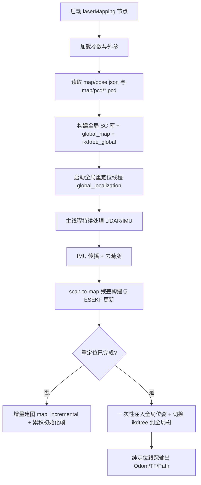
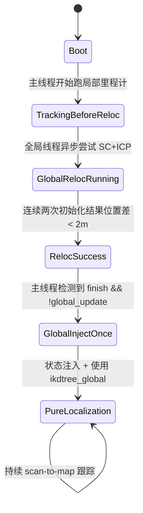
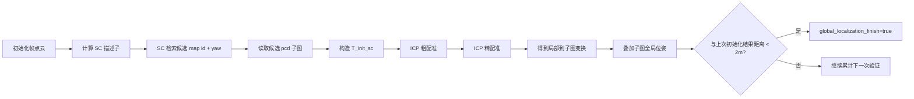
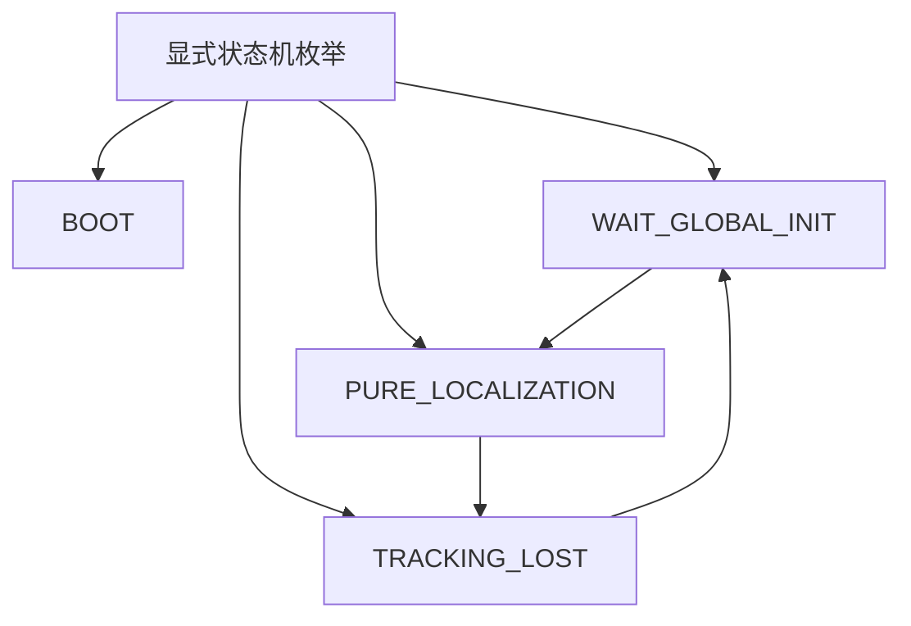

# YWL0720_FAST-LOCALIZATION 代码阅读笔记（重定位/纯定位实现专项）

## 1. 阅读目标与结论先行

本笔记聚焦 `YWL0720_FAST-LOCALIZATION` 中“重定位/纯定位模式”的真实实现路径，重点回答：

- 程序如何启动、如何组织 LiDAR/IMU 数据流；
- 重定位是如何触发、判定成功并切换到纯定位的；
- 纯定位阶段如何持续输出位姿；
- 代码中“配置含义”与“实际执行”有哪些偏差；
- 现有实现在工程化与鲁棒性上的风险点。

**核心结论（最重要）**：

1. 代码确实实现了“先全局重定位，再纯定位跟踪”的两阶段流程；
2. “模式切换”并非由 `common/localization_mode` 参数驱动，而是由内部状态 `global_localization_finish/global_update` 驱动；
3. `common/localization_mode` 当前是“悬空参数”（读了但没参与分支）；
4. 运行期缺少“跟踪丢失 -> 自动回到重定位”闭环状态机。

---

## 2. 与定位链路最相关文件（按重要性）

1. `YWL0720_FAST-LOCALIZATION/src/laserMapping.cpp`  
   主程序：入口、参数、回调、全局重定位线程、scan-to-map 更新、输出发布。
2. `YWL0720_FAST-LOCALIZATION/src/IMU_Processing.hpp`  
   IMU 初始化/传播、点云去畸变核心。
3. `YWL0720_FAST-LOCALIZATION/src/preprocess.cpp`  
   多雷达输入预处理、点时间戳字段整理。
4. `YWL0720_FAST-LOCALIZATION/include/use-ikfom.hpp`  
   ESEKF 状态定义与系统模型接口。
5. `YWL0720_FAST-LOCALIZATION/include/common_lib.h`  
   数据结构与平面拟合等基础函数。
6. `YWL0720_FAST-LOCALIZATION/include/Scancontext/Scancontext.cpp`  
   Scan Context 构建、检索与 yaw 初值估计。
7. `YWL0720_FAST-LOCALIZATION/config/mid360.yaml`  
   启动参数（含 `localization_mode` 注释）。
8. `YWL0720_FAST-LOCALIZATION/launch/localization_mid360.launch`  
   节点启动入口。

---

## 3. 程序总流程（从启动到稳定定位）

### 3.1 节点与回调

- 节点名：`laserMapping`
- LiDAR 回调：
  - `livox_pcl_cbk`（Livox）
  - `standard_pcl_cbk`（标准 PointCloud2）
- IMU 回调：`imu_cbk`
- 主循环通过 `sync_packages(Measures)` 拼一帧 LiDAR + 对应时间窗 IMU。

### 3.2 主循环每帧关键步骤

1. `sync_packages` 对齐数据；
2. `p_imu->Process` 做状态传播和点云去畸变；
3. 下采样点云，构建有效特征；
4. `kf.update_iterated_dyn_share_modified(...)` 执行迭代更新（内部用 `h_share_model` 组织点面残差）；
5. 发布 odom/tf/点云；
6. 若未完成全局重定位，继续增量建图并缓存初始化帧给全局线程。

---

## 4. “重定位/纯定位模式”真实实现（重点）

## 4.1 配置层与实现层不一致

- 参数读取：`common/localization_mode`
- 配置注释：`1 for given init pose, 2 for dynamic init`
- 代码现实：`localization_mode` 仅定义与读取，**未用于任何分支控制**。

即当前版本“模式切换”不是配置驱动，而是运行时状态驱动。

## 4.2 真正的模式切换变量

- `global_localization_finish`：全局重定位是否成功；
- `global_update`：是否已经把全局结果注入主滤波状态（只做一次）。

### 4.3 实际状态机（按代码还原）

---

## 5. 全局重定位实现细节（SC + ICP）

全局重定位在独立线程 `global_localization()` 中进行，逻辑如下：

1. 从初始化缓存帧 `init_feats_down_bodys` 取当前帧；
2. 计算该帧 Scan Context；
3. 在地图 SC 库检索候选帧 `localization_id` 与 `yaw_init`；
4. 读取候选地图子图 `map/pcd/<id>.pcd`；
5. 使用 `yaw_init` 构造初始位姿；
6. 执行两段 ICP：
   - 粗配准（较大对应距离）
   - 精配准（较小对应距离）
7. 将匹配结果叠加到候选地图帧全局位姿，得到当前全局初值；
8. 若连续两次初值位置差小于阈值（2m），判定重定位成功。

---

## 6. 纯定位实现细节（重定位后）

当主线程检测到 `global_localization_finish && !global_update`：

1. 把 `init_result` 计算得到的全局位姿注入当前状态；
2. 用 `ikdtree_global` 替换当前地图树；
3. 置 `global_update = true`，完成一次性切换；
4. 后续进入稳定纯定位：仅做 scan-to-map + ESEKF 更新，持续输出 `/Odometry`、TF、路径。

**行为特征**：

- 重定位完成后，主循环不再走“前期增量建图”分支；
- 更像“在固定全局地图上做跟踪定位”。

---

## 7. LiDAR/IMU 融合与去畸变链路

## 7.1 融合方式

- 采用 IKFoM/ESEKF 风格：
  - 预测：IMU 动力学模型；
  - 更新：LiDAR 点到平面残差。

## 7.2 去畸变

- 在 `ImuProcess::UndistortPcl` 中完成：
  - 先按点内时间排序；
  - 使用 IMU 前向传播获得时序姿态；
  - 对每个点做反向补偿到统一时刻（一般是帧尾）。

## 7.3 时间同步

- 支持固定时间偏移 `time_offset_lidar_to_imu`；
- 可选在线估计偏移（`time_sync_en`）。

---

## 8. 地图组织与数据结构

## 8.1 全局地图构建

- 文件来源固定为 `ROOT_DIR/map/pose.json` 与 `ROOT_DIR/map/pcd/*.pcd`；
- `pose.json` 提供每个子图的全局位姿；
- 加载时将每个子图变换到全局系并合并成 `global_map`；
- 构建 `ikdtree_global` 作为纯定位阶段查询结构。

## 8.2 在线地图结构

- `ikdtree`：主线程用于近邻查询的当前地图树；
- 重定位前：可增量插入新点（`map_incremental`）；
- 重定位后：切换为 `ikdtree_global`（固定地图定位）。

---

## 9. 输出链路（Topic）

- 位姿：
  - `/Odometry`
  - TF：`camera_init -> body`
- 点云：
  - `/cloud_registered`（世界系）
  - `/cloud_registered_body`（机体系）
- 轨迹：
  - `/path`（在 `path_en` 且全局重定位完成后发布）
- 地图：
  - `/global_map`（加载阶段发布）

---

## 10. 关键函数清单（建议重点读）

1. `main`（`src/laserMapping.cpp`）  
   总控入口，初始化 + 主循环 + 线程。
2. `sync_packages`（`src/laserMapping.cpp`）  
   LiDAR/IMU 组包对齐。
3. `livox_pcl_cbk`（`src/laserMapping.cpp`）  
   Livox 数据回调、同步补偿。
4. `standard_pcl_cbk`（`src/laserMapping.cpp`）  
   标准 LiDAR 回调。
5. `imu_cbk`（`src/laserMapping.cpp`）  
   IMU 入队处理。
6. `global_localization`（`src/laserMapping.cpp`）  
   SC 检索 + ICP 初始化核心线程。
7. `load_file`（`src/laserMapping.cpp`）  
   地图与位姿文件加载，构建 SC 库与全局树。
8. `h_share_model`（`src/laserMapping.cpp`）  
   点到面残差/雅可比构建核心。
9. `map_incremental`（`src/laserMapping.cpp`）  
   重定位前的增量地图更新。
10. `ImuProcess::Process`（`src/IMU_Processing.hpp`）  
   IMU 初始化+去畸变入口。
11. `ImuProcess::UndistortPcl`（`src/IMU_Processing.hpp`）  
   去畸变主实现。
12. `SCManager::detectLoopClosureID`（`include/Scancontext/Scancontext.cpp`）  
   SC 候选检索与 yaw 估计。

---

## 11. 与“重定位/纯定位”直接相关的工程风险

1. **参数与行为不一致**  
   `localization_mode` 读了但没用，容易误导部署人员。
2. **地图路径硬编码倾向**  
   虽有 `map_file_path` 参数读取，但关键加载逻辑走 `ROOT_DIR/map/...`。
3. **初始化流程含阻塞交互**  
   `getchar()` 会阻塞自动化启动流程。
4. **缺失运行时重定位闭环**  
   没有明确“跟踪失败 -> 自动重定位”状态迁移。
5. **阈值较多且硬编码**  
   ICP 距离、成功判据、匹配阈值等缺乏统一参数化。
6. **线程与缓存增长问题**  
   初始化缓存向量存在长期累积风险，重定位线程成功后有空转风险。

---

## 12. 建议的最小改造方向（不改算法、先改可维护性）

建议最小改造项：

1. 新增显式状态枚举，替代多个布尔变量隐式组合；
2. 将 `localization_mode` 真正接入状态机入口策略；
3. 将关键阈值（SC、ICP、成功判定）全部参数化；
4. 增加“跟踪质量评估指标”，触发自动重定位；
5. 去掉 `getchar()`，改为参数控制是否自动加载地图。

---

## 13. 读代码顺序建议（节省时间版）

1. 先读 `src/laserMapping.cpp` 的 `main`、`global_localization`、`h_share_model`；
2. 再读 `src/IMU_Processing.hpp` 的 `Process/UndistortPcl`；
3. 再看 `include/Scancontext/Scancontext.cpp` 的检索入口；
4. 最后对照 `config/mid360.yaml` 校验参数是否真正生效。

按这条顺序，能最快建立“重定位 -> 切换 -> 纯定位跟踪”的完整心智模型。

