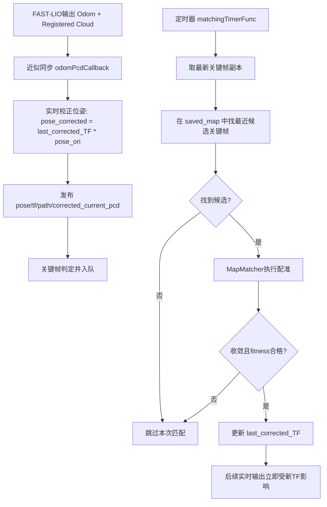
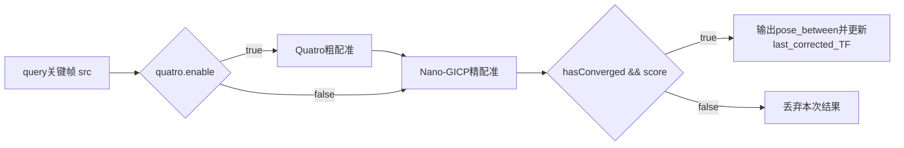
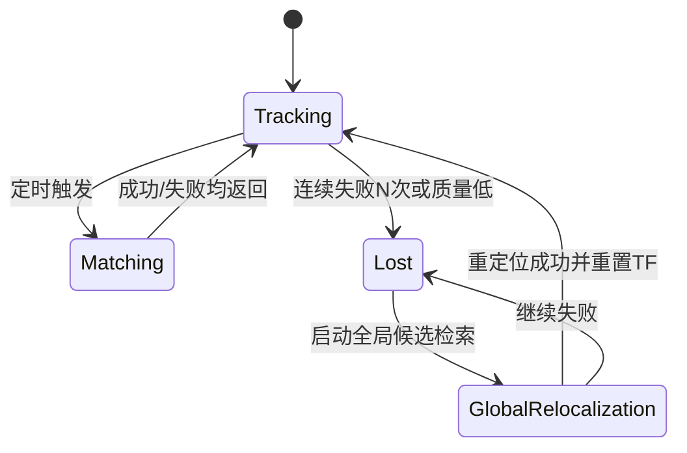

# engcang_FAST-LIO-Localization-QN 代码阅读笔记（重定位/纯定位实现专项）

## 1. 先说结论（你最关心的点）

这个仓库并没有实现“显式的重定位模式 vs 纯定位模式”状态机（没有类似 `MODE_RELOCALIZATION / MODE_LOCALIZATION` 的分支）。  
它的真实工作方式是：

1. 依赖外部 `fast_lio` 实时输出 `/Odometry` 和 `/cloud_registered`；
2. 本节点持续用一个全局修正变换 `last_corrected_TF_` 对 FAST-LIO 里程计做纠偏，输出校正位姿；
3. 定时器触发“关键帧地图匹配”（Quatro+Nano-GICP 或 Nano-GICP），匹配成功就更新 `last_corrected_TF_`；
4. 匹配失败则保持旧 `last_corrected_TF_` 继续跑，不会切换到独立“重定位失败恢复状态”。

因此，它更像“持续定位 + 间歇性全局纠偏”，而不是“先重定位再切纯定位”的硬切换架构。

---

## 2. 与定位主链路最相关文件（按重要性）

1. `engcang_FAST-LIO-Localization-QN/fast_lio_localization_qn/src/fast_lio_localization_qn.cpp`
2. `engcang_FAST-LIO-Localization-QN/fast_lio_localization_qn/src/map_matcher.cpp`
3. `engcang_FAST-LIO-Localization-QN/fast_lio_localization_qn/include/fast_lio_localization_qn.h`
4. `engcang_FAST-LIO-Localization-QN/fast_lio_localization_qn/include/map_matcher.h`
5. `engcang_FAST-LIO-Localization-QN/fast_lio_localization_qn/include/pose_pcd.hpp`
6. `engcang_FAST-LIO-Localization-QN/fast_lio_localization_qn/include/utilities.hpp`
7. `engcang_FAST-LIO-Localization-QN/fast_lio_localization_qn/src/main.cpp`
8. `engcang_FAST-LIO-Localization-QN/fast_lio_localization_qn/config/config.yaml`
9. `engcang_FAST-LIO-Localization-QN/fast_lio_localization_qn/launch/run.launch`
10. `engcang_FAST-LIO-Localization-QN/third_party/fastlio_config_launch/*`

---

## 3. 启动与运行主链路

## 3.1 启动入口

- 入口：`src/main.cpp`
- 节点：`fast_lio_localization_qn_node`
- 执行模型：`ros::AsyncSpinner(3)` 并发处理回调

## 3.2 构造阶段（核心初始化）

在 `FastLioLocalizationQn` 构造函数中：

1. 读取参数（`/basic/*`, `/keyframe/*`, `/match/*`, `/nano_gicp/*`, `/quatro/*`）；
2. 初始化 `MapMatcher`；
3. `loadMap(saved_map_path)` 加载离线保存地图；
4. 配置订阅器：
   - `/Odometry`
   - `/cloud_registered`
   - 通过 `message_filters` 近似时间同步；
5. 注册主回调 `odomPcdCallback`；
6. 注册定时器 `matchingTimerFunc`（频率 `map_match_hz`）；
7. 初始化各类发布器（pose/path/tf/map_match/点云可视化）。

## 3.3 两条并行主逻辑

---

## 4. 参数体系与“模式”相关配置

来自 `config/config.yaml` 的关键项：

- `basic.map_match_hz`：地图匹配频率
- `match.match_detection_radius`：候选关键帧检索半径
- `quatro.enable`：是否开启 Quatro 粗配准
- `nano_gicp.*`：GICP阈值、迭代次数、线程数等
- `keyframe.keyframe_threshold`：关键帧间距阈值

### 4.1 关键判断

- **无显式任务模式参数**（没有 `localization_mode` 一类用于状态切换）
- `quatro.enable` 仅是“配准算法分支”开关，不是定位模式开关

---

## 5. 地图组织与数据结构

## 5.1 地图来源

`loadMap()` 从 bag 读取两类消息：

- `/keyframe_pose`
- `/keyframe_pcd`

每对消息组成一个 `PosePcdReduced`，存入 `saved_map_from_bag_`。

## 5.2 地图用途划分

- `saved_map_from_bag_`：用于匹配检索与构建局部目标子图
- `saved_map_pcd_`：全图可视化发布（下采样后）

## 5.3 检索方式

- `fetchClosestKeyframeIdx()` 采用线性遍历，按欧氏距离找半径内最近关键帧
- 未见 KD-tree / ikd-tree / ScanContext 全局检索结构

---

## 6. 重定位/纠偏算法链路（本仓库语义）

虽然代码里没有单独“重定位模式”，但定时匹配成功本质上承担“重定位纠偏”作用。

## 6.1 候选选择

输入：最新 query 关键帧（校正系）  
过程：在 `saved_map_from_bag_` 中找半径内最近关键帧  
输出：候选索引 `dst_idx`（若失败则 -1）

## 6.2 构建 src / dst 点云

`setSrcAndDstCloud()`：

- `src`：query关键帧点云
- `dst`：
  - Quatro开启：多用更集中候选（邻域较小）
  - Quatro关闭：使用 `dst_idx ± submap_range` 拼接子图
- 二者都会体素降采样

## 6.3 配准流程

## 6.4 成功判据

- `hasConverged() == true`
- `fitness_score < icp_score_threshold`

匹配成功后更新：

- `last_corrected_TF_ = pose_between * last_corrected_TF_`

---

## 7. “纯定位”在该项目中的真实含义

该项目的“纯定位”更准确应理解为：

- 持续接收 FAST-LIO 实时里程计；
- 持续应用最近的全局纠偏变换 `last_corrected_TF_`；
- 周期性尝试 map matching 来刷新该纠偏变换；
- 无匹配成功时继续沿用旧变换运行。

也就是说，它没有“停掉重定位线程后仅局部跟踪”的独立阶段，而是始终允许定时纠偏。

---

## 8. IMU/LiDAR 融合、时间同步、去畸变

这一部分主要不在本仓库核心代码实现，而在其依赖的 FAST-LIO 节点：

- 本仓库直接消费：
  - `/Odometry`
  - `/cloud_registered`
- IMU融合、时钟同步、点云去畸变由 FAST-LIO 侧完成；
- 相关配置在 `third_party/fastlio_config_launch/*.yaml`（如 `time_sync_en`, `time_offset_lidar_to_imu`, 外参等）。

---

## 9. 输出链路（Topic与TF）

- 实时位姿：`/pose_stamped`
- TF：`map -> robot`
- 轨迹：
  - `/ori_odom`, `/ori_path`
  - `/corrected_odom`, `/corrected_path`
- 当前帧点云：`/corrected_current_pcd`
- 匹配可视化：
  - `/map_match`
  - `/src`, `/dst`
  - `/coarse_aligned_quatro`, `/fine_aligned_nano_gicp`
- 地图可视化：`/saved_map`

---

## 10. 关键函数索引（>=12个）

1. `main` (`src/main.cpp`)：节点入口  
2. `FastLioLocalizationQn::FastLioLocalizationQn` (`src/fast_lio_localization_qn.cpp`)：参数+订阅+定时器+地图加载  
3. `FastLioLocalizationQn::odomPcdCallback`：实时链路主回调  
4. `FastLioLocalizationQn::matchingTimerFunc`：定时匹配主回调  
5. `FastLioLocalizationQn::loadMap`：地图bag读取与构建  
6. `FastLioLocalizationQn::checkIfKeyframe`：关键帧判定  
7. `FastLioLocalizationQn::updateOdomsAndPaths`：轨迹缓存更新  
8. `MapMatcher::fetchClosestKeyframeIdx`：候选关键帧检索  
9. `MapMatcher::setSrcAndDstCloud`：构造匹配点云对  
10. `MapMatcher::performMapMatcher`：匹配总入口  
11. `MapMatcher::coarseToFineAlignment`：Quatro+GICP  
12. `MapMatcher::icpAlignment`：Nano-GICP精配准  
13. `PosePcd::PosePcd` (`include/pose_pcd.hpp`)：帧数据封装  
14. `transformPcd` (`include/utilities.hpp`)：点云刚体变换工具  
15. `poseEigToPoseStamped` (`include/utilities.hpp`)：位姿消息转换

---

## 11. 与“重定位/纯定位”相关的关键风险

1. **缺少显式状态机**  
   无“全局重定位失败恢复流程”，仅单次失败后跳过。

2. **检索半径依赖强**  
   必须先落入 `match_detection_radius` 才可能匹配成功；初值差大时可能长期无法纠偏。

3. **候选检索复杂度高**  
   线性扫描关键帧，地图增大后时延上升。

4. **无全局召回机制**  
   未集成 ScanContext/Place Recognition 类全局候选检索。

5. **纠偏更新是“增量叠乘”**  
   缺少图优化级别的全局一致性回传。

6. **失败处理偏保守**  
   失败后继续使用旧 `last_corrected_TF_`，长期漂移时恢复能力有限。

---

## 12. 建议改造方向（按优先级）

优先建议：

1. 增加显式状态机（`Tracking/Matching/Lost/GlobalReloc`）；
2. 引入全局候选检索（如 ScanContext）；
3. 匹配失败计数与自适应搜索半径；
4. 为 `last_corrected_TF_` 更新加质量门控与异常回滚；
5. 提供运行时诊断topic（匹配成功率、score、候选数量）。

---

## 13. 快速阅读顺序（建议）

1. `src/fast_lio_localization_qn.cpp`：先抓主流程  
2. `src/map_matcher.cpp`：再看匹配细节  
3. `config/config.yaml`：对照参数和行为  
4. `launch/run.launch` + `third_party/fastlio_config_launch`：理解输入来源与依赖边界

按这个顺序，你可以最快建立“实时定位 + 定时纠偏”这一真实架构心智模型。

