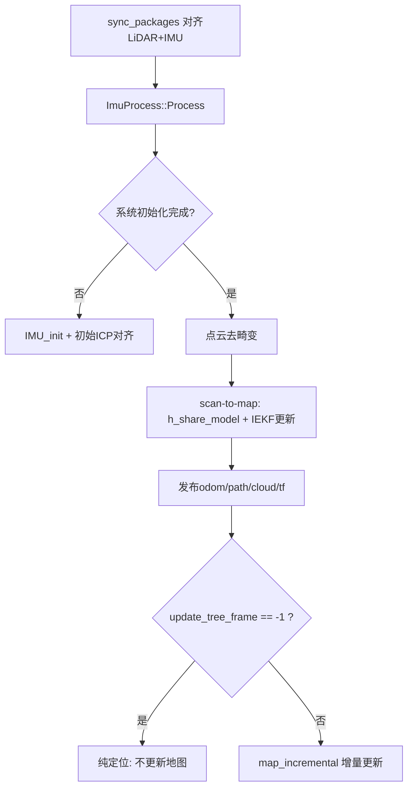
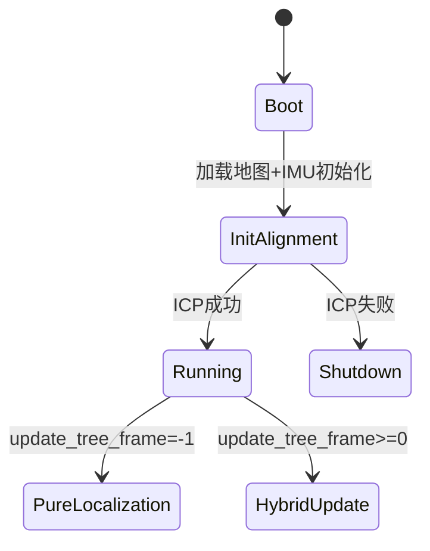

# iral-ntua_FAST_LIO_LOCALIZATION 代码阅读笔记（重定位/纯定位实现专项）

## 1. 核心结论

这个仓库实现的是“**启动阶段一次性全局初始化重定位 + 运行期 FAST-LIO 纯定位/可选扩图**”：

1. 启动时读取先验 PCD 地图 `path_pcd`；
2. IMU 初始化后，用给定初始位姿 `approximate_init_pose` 做 ICP 对齐；
3. 对齐成功后将变换写入滤波状态并开始任务（`start_mission=true`）；
4. 运行期通过 `update_tree_frame` 控制是否更新地图：
   - `-1`：纯定位（不更新地图）
   - `>=0`：定位+增量更新

---

## 2. 关键文件（按重要性）

1. `iral-ntua_FAST_LIO_LOCALIZATION/src/laserMapping.cpp`
2. `iral-ntua_FAST_LIO_LOCALIZATION/src/IMU_Processing.hpp`
3. `iral-ntua_FAST_LIO_LOCALIZATION/src/preprocess.cpp`
4. `iral-ntua_FAST_LIO_LOCALIZATION/src/preprocess.h`
5. `iral-ntua_FAST_LIO_LOCALIZATION/include/use-ikfom.hpp`
6. `iral-ntua_FAST_LIO_LOCALIZATION/include/common_lib.h`
7. `iral-ntua_FAST_LIO_LOCALIZATION/config/avia.yaml`
8. `iral-ntua_FAST_LIO_LOCALIZATION/config/velodyne.yaml`
9. `iral-ntua_FAST_LIO_LOCALIZATION/launch/mapping_avia.launch`
10. `iral-ntua_FAST_LIO_LOCALIZATION/CMakeLists.txt`

---

## 3. 入口、初始化与主流程

## 3.1 入口

- 可执行程序：`fastlio_mapping`
- 主入口：`src/laserMapping.cpp` 中 `main()`

## 3.2 初始化阶段

1. 读取参数（含 `path_pcd`, `update_tree_frame`, `approximate_init_pose`）；
2. 订阅 LiDAR 与 IMU；
3. 发布 odom/path/cloud/tf；
4. 加载先验地图 PCD 并构建 `ikdtree`；
5. 进入主循环并等待系统初始化完成。

## 3.3 主循环

---

## 4. 重定位/纯定位模式实现

## 4.1 显式参数开关（有）

- `common/update_tree_frame`
  - `-1`：exclusive localization（纯定位）
  - `>=0`：达到阈值帧后开始更新地图

关键逻辑位于 `map_incremental()`，只有 `update_thr != -1` 才插入新点。

## 4.2 重定位触发方式

不是运行时独立重定位节点，而是**启动阶段一次性初始化重定位**：

- 输入：`approximate_init_pose`（4x4）
- 算法：PCL ICP（在 IMU 初始化流程中触发）
- 成功后首帧将初始化变换注入状态。

## 4.3 状态机抽象

---

## 5. 地图来源与组织

## 5.1 地图来源

- `common/path_pcd` 指向预构建地图；
- 启动时 `loadPCDFile` 读入 `initial_map`。

## 5.2 地图结构

- 核心索引：`ikdtree`
- 局部窗口：`LocalMap_Points` + `lasermap_fov_segment()`
- 动态操作：
  - `Nearest_Search`
  - `Delete_Point_Boxes`
  - `Add_Points`

## 5.3 关键帧机制

- 未见独立关键帧/回环图优化模块；
- 主要是点级地图 + 局部窗口化管理。

---

## 6. 启动重定位算法细节

## 6.1 输入与初值

- 初值来自 `approximate_init_pose` 参数；
- 当前初始帧点云经过 `init_pose.inverse()` 预变换。

## 6.2 算法

1. IMU 初始化阶段累积点云；
2. 对先验地图做 ICP；
3. 得到 `transformation`；
4. 在首个 odom 输出前注入滤波状态。

## 6.3 成功判据与失败处理

- 判据：`icp.hasConverged()`
- 失败处理：`ros::shutdown()` 直接退出（无自动重试）

---

## 7. 纯定位跟踪流程（运行阶段）

每帧流程：

1. `sync_packages()` 时间对齐；
2. `ImuProcess::Process()` 预测与去畸变；
3. 下采样点云；
4. `h_share_model()` 计算点面残差；
5. `kf.update_iterated_dyn_share_modified(...)`；
6. 发布 odom/path/cloud；
7. 根据 `update_tree_frame` 决定是否增量更新地图。

残差建立逻辑：

- 邻域 5 点
- 平面拟合 `esti_plane`
- 点到面距离作为测量残差

---

## 8. IMU/LiDAR 融合、同步、去畸变

## 8.1 融合框架

- IKFoM 迭代误差状态卡尔曼；
- 状态包括位姿、速度、偏置、重力和外参。

## 8.2 时间同步

- 参数：
  - `time_sync_en`
  - `time_offset_lidar_to_imu`
- 支持固定偏移与简化软件同步。

## 8.3 去畸变

- `UndistortPcl()`：
  - IMU前向积分轨迹
  - 点按时间反向补偿到帧末

---

## 9. 输出链路

- `/Odometry`
- TF：`camera_init -> base_link`
- `/path`
- `/cloud_registered`
- `/cloud_registered_body`
- `/cloud_effected`（函数存在，主流程常注释）
- `/Laser_map`（函数存在，主流程常注释）
- 初始化完成后设置参数：`start_mission=true`

---

## 10. 关键函数索引（>=12）

1. `main` (`src/laserMapping.cpp`)  
2. `sync_packages` (`src/laserMapping.cpp`)  
3. `standard_pcl_cbk` (`src/laserMapping.cpp`)  
4. `livox_pcl_cbk` (`src/laserMapping.cpp`)  
5. `imu_cbk` (`src/laserMapping.cpp`)  
6. `map_incremental` (`src/laserMapping.cpp`)  
7. `lasermap_fov_segment` (`src/laserMapping.cpp`)  
8. `h_share_model` (`src/laserMapping.cpp`)  
9. `publish_odometry` (`src/laserMapping.cpp`)  
10. `publish_frame_world` (`src/laserMapping.cpp`)  
11. `ImuProcess::Process` (`src/IMU_Processing.hpp`)  
12. `ImuProcess::IMU_init` (`src/IMU_Processing.hpp`)  
13. `ImuProcess::UndistortPcl` (`src/IMU_Processing.hpp`)  
14. `Preprocess::process` (`src/preprocess.cpp`)  
15. `Preprocess::avia_handler / velodyne_handler / oust64_handler` (`src/preprocess.cpp`)

---

## 11. 风险与技术债（重定位失败恢复重点）

1. **初始化重定位失败即停机**  
   缺少重试、扩搜索、人工交互重置等恢复路径。

2. **无运行时再重定位机制**  
   漂移或失锁后不会自动触发全局重定位。

3. **强依赖初值 `approximate_init_pose`**  
   初值偏差大时 ICP 可能失败或落局部最优。

4. **纯定位模式长期环境变化鲁棒性弱**  
   `update_tree_frame=-1` 时地图固定，环境变化会降低匹配质量。

5. **退化场景处理弱**  
   `No Effective Points` 仅告警，不触发状态回退。

6. **同步策略工程化较简化**  
   在复杂时钟漂移场景下可能不足。

---

## 12. 一句话评价

这是一个“**一次性启动重定位 + 运行期 IEKF scan-to-map + 参数控制是否扩图**”的实现；  
结构简洁，但在“失败恢复与在线再重定位”方面仍有明显提升空间。

